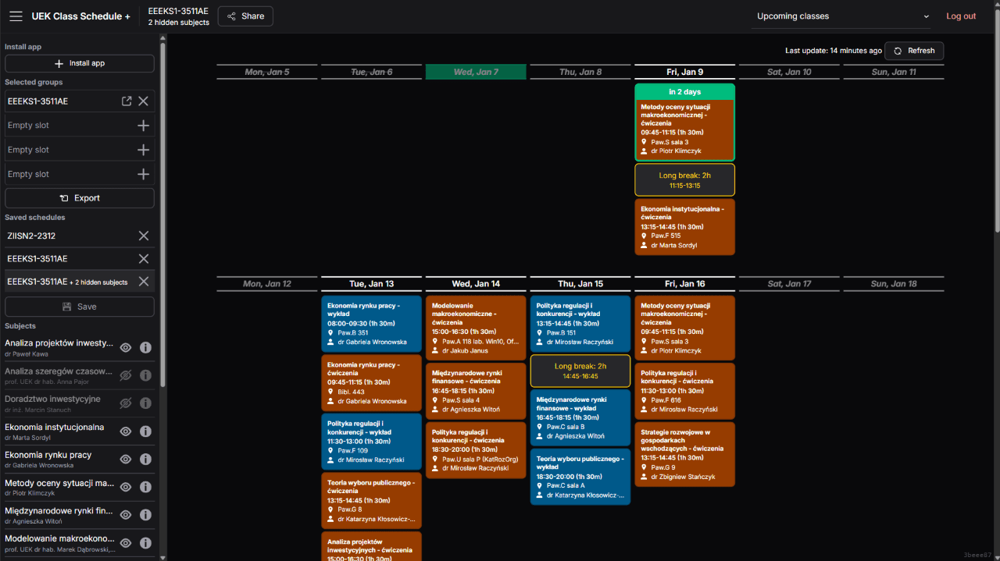
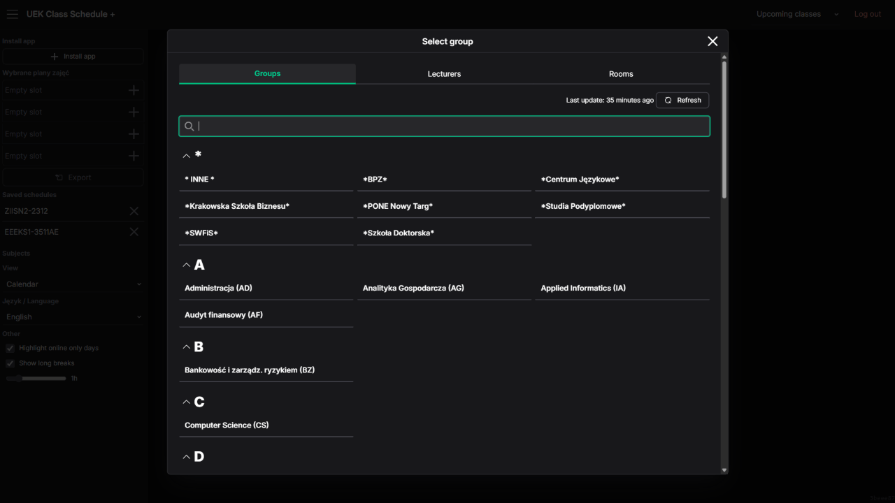

# [UEK Class Schedule +](https://uek.muflon.cc/)

**Alternative client for the official [Plan Zajęć UEK](https://planzajec.uek.krakow.pl/)**  
[Polski README](README.md)

| Calendar                                                      | Choosing schedule                                                      |
| ------------------------------------------------------------- | ---------------------------------------------------------------------- |
|  |  |

## Extra functionality

✅ Automatic login to the schedule  
✅ Join schedules (eg. main group + language groups)  
✅ Works offline  
✅ Export to other calendars (Google Calendar, iOS Calendar, .ical)  
✅ Hide specific classes (eg. choosable classes you did not choose)  
✅ Subject details (how many classes/hours are remaining/done in the semester, when is the next class)  
✅ Highlight long breaks between on-site classes and online-only days  
✅ Show all upcoming classes by default (not just next 2 weeks)

## Old versions

- [V1](https://github.com/szczursonn/uek-planzajec) - NextJS Page Router
- [V2](https://github.com/szczursonn/uek-planzajec-v2) - SvelteKit
- [V3](https://github.com/szczursonn/uek-planzajec-v3) - Go + Preact
