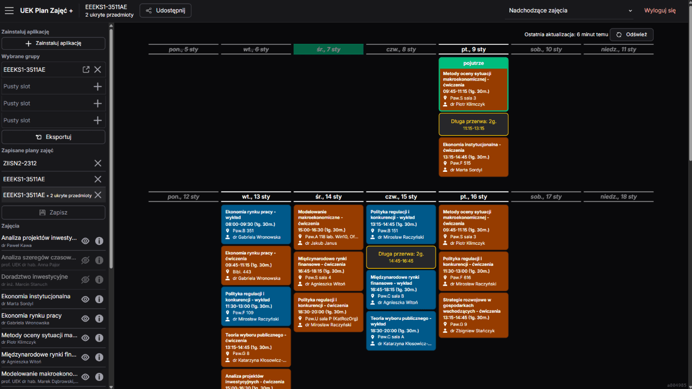
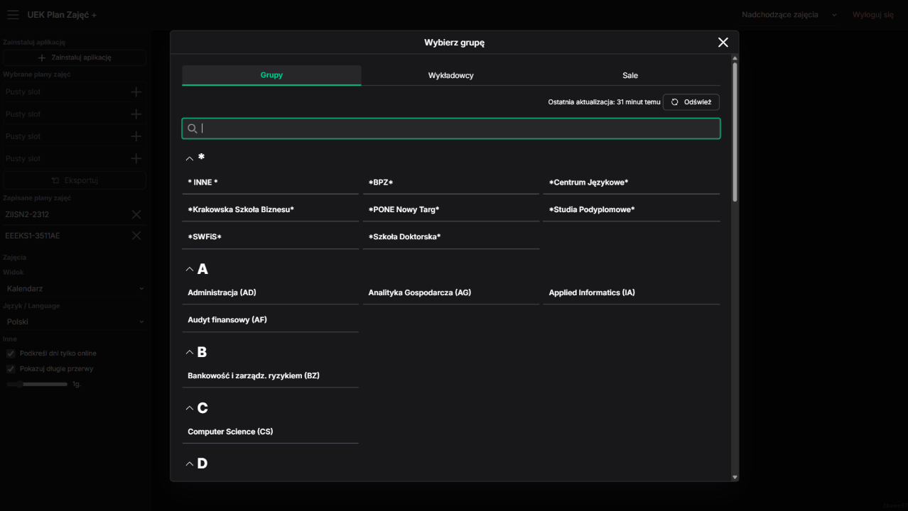

# [UEK Plan Zajęć +](https://uek.muflon.cc/)

**Alternatywny klient dla oficjalnego [Planu Zajęć UEK](https://planzajec.uek.krakow.pl/)**  
[English README](README.en.md)

| Kalendarz                                                      | Wybieranie planu zajęć                                                     |
| -------------------------------------------------------------- | -------------------------------------------------------------------------- |
|  |  |

## Dodatkowe funkcje

✅ Automatyczne logowanie do planu zajęć  
✅ Łączenie planów zajęć (np. grupa kierunkowa + grupy językowe)  
✅ Działa offline  
✅ Export do innych kalendarzy (Kalendarz Google, Kalendarz iOS, .ical)  
✅ Ukrywanie wybranych zajęć (np. zajęcia do wyboru na które nie jest się zapisanym)  
✅ Detale zajęć (ile zajęć/godzin pozostało/minęło w semestrze, kiedy najbliższe zajęcia)  
✅ Podkreślanie długich przerw między zajęciami na uczelni oraz dni z zajęciami tylko online  
✅ Wyświetlanie wszystkich nadchodzących zajęć domyślnie (nie tylko najbliższe 2 tygodnie)

## Stare wersje

- [V1](https://github.com/szczursonn/uek-planzajec) - NextJS Page Router
- [V2](https://github.com/szczursonn/uek-planzajec-v2) - SvelteKit
- [V3](https://github.com/szczursonn/uek-planzajec-v3) - Go + Preact
